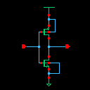
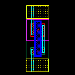

# 90nm CMOS Inverter Design: From Schematic to Post-Layout Thermal Analysis
## Project Overview
This project demonstrates a complete custom IC design flow for a high-performance CMOS Inverter using a 90nm Process Design Kit (PDK). The workflow covers initial schematic sizing for symmetry, manual layout construction, Parasitic Extraction (PEX), and advanced reliability testing under extreme thermal conditions (10°C to 60°C)
## Tools: 
- Synopsys Custom compiler
- Synopsys Custome Waveview
## Schematic: 

## Layout: 

## Starrc: 

## Author:
- Nguyen Dinh Anh - Email: anhdinh30012005work@gmail.com
